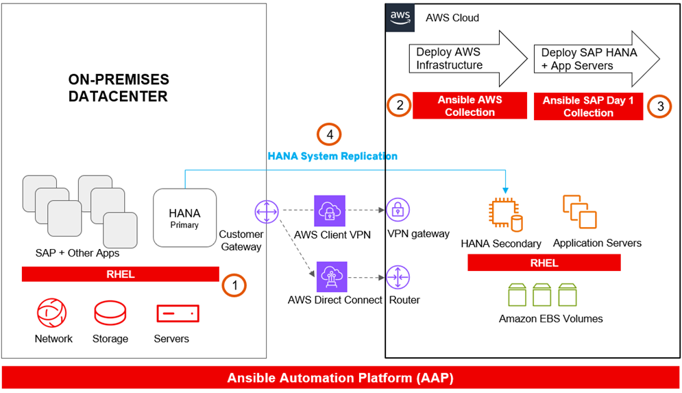

# SAP HANA Migration to AWS with Ansible (Fully Functional, Commented)



This repository provides a **working** Ansible project to migrate SAP HANA from on‑prem to AWS,
with **line‑by‑line commented playbooks** so junior/mid DevOps engineers can both learn and deploy.

> ⚠️ **Important:** All credentials/IDs/paths in `inventories/dev/group_vars/all.yml` are **placeholders**.
> Replace them with your own values. **Do not commit real secrets**. Prefer IAM roles or environment variables.

## What this repo does

1. **Provision** AWS EC2 for HANA + optional app server (`playbooks/01_provision_infra.yml`).
2. **Preconfigure RHEL** for SAP using Red Hat Day‑1 roles (`02_rhel_preconfigure.yml`).
3. **Install SAP HANA** via the Red Hat HANA install role (`03_install_hana.yml`).
4. **Configure HSR** between on‑prem primary and AWS secondary (`04_configure_hsr.yml`).

## Prerequisites

- Ansible >= 2.14, Python >= 3.9
- Access to **Red Hat Ansible Automation Hub** collections (e.g., `redhat.sap_install`)
- AWS account with permissions to create EC2, EBS, etc. (use IAM roles/profiles)
- RHEL for SAP Solutions AMIs
- SAP HANA installation media (mount/copy to the hosts or control node)

## Quick start

```bash
# 0) Clone
git clone https://github.com/YOUR_USERNAME/sap-hana-migration-ansible-full.git
cd sap-hana-migration-ansible-full

# 1) Install Ansible collections
ansible-galaxy collection install -r collections/requirements.yml

# 2) Configure variables (placeholders)
$EDITOR inventories/dev/group_vars/all.yml

# 3) Provision infra
ansible-playbook playbooks/01_provision_infra.yml

# 4) Preconfigure RHEL
ansible-playbook playbooks/02_rhel_preconfigure.yml

# 5) Install HANA
ansible-playbook playbooks/03_install_hana.yml

# 6) Configure HSR
ansible-playbook playbooks/04_configure_hsr.yml
```

## Credentials and security

- **Never** hard‑code AWS keys or SAP passwords. Use:
  - IAM roles/instance profiles
  - `AWS_PROFILE` and `~/.aws/credentials`
  - Ansible Vault for passwords (e.g., `sap_master_password`)
- Replace `REPLACE_ME` values in `inventories/dev/group_vars/all.yml`.

## CI/CD

GitHub Actions runs **yamllint** and **ansible‑lint** on PRs and pushes (`.github/workflows/ci.yml`).

## Learning path

Each playbook includes comments explaining **what each task does** and **why**.
Start at `01_provision_infra.yml` and proceed in order. Read comments inline.

## License

MIT
